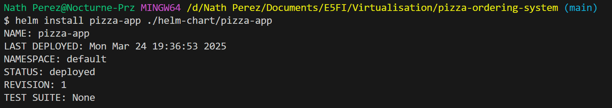
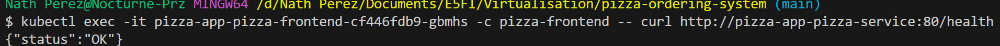
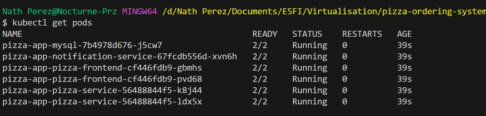
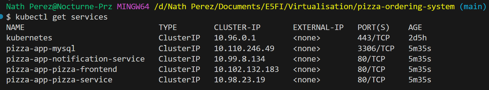
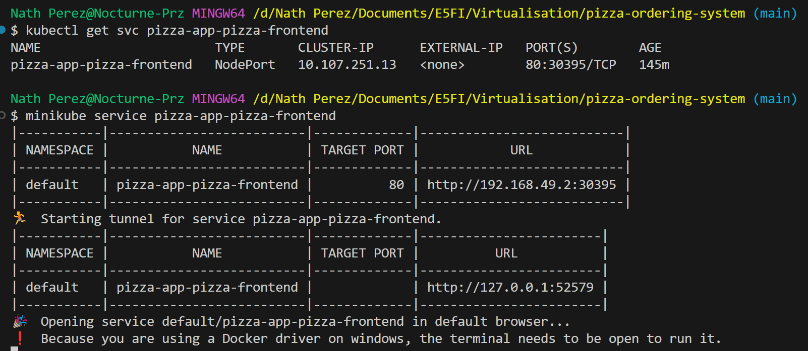
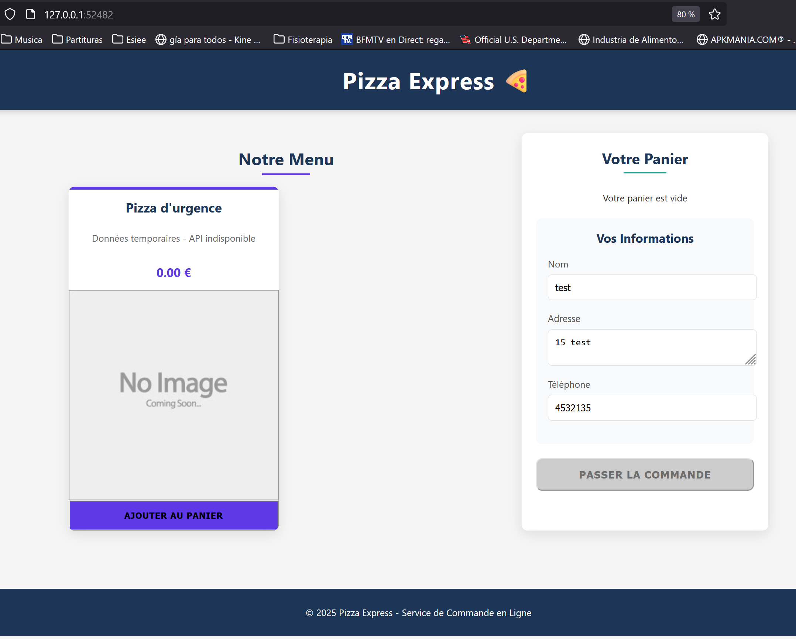
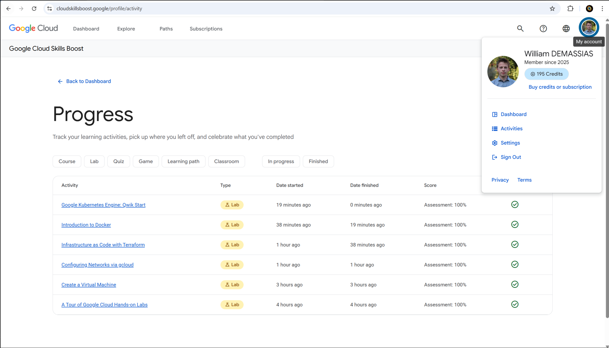
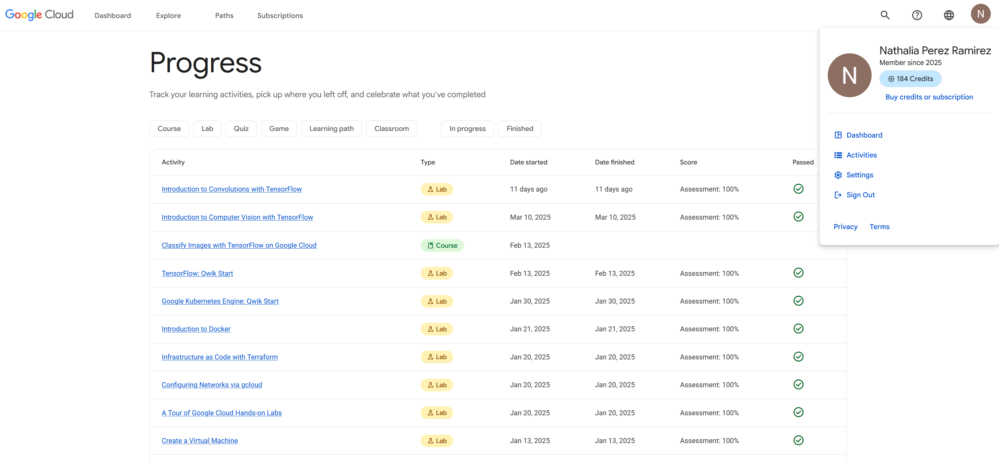

# 🍕 Système de Commande de Pizzas - Projet Virtualisation

Ce projet implémente un système de commande de pizzas en ligne avec une architecture microservices déployée sur Kubernetes.

## 🏗️ Architecture Système

Le système est composé de plusieurs services:

- **Service de Commande (Backend)**: 
  - API REST développée en Node.js
  - Gestion des pizzas et des commandes
  - Implémentation avec Express

- **Service de Notification**: 
  - Gestion des notifications clients
  - Communication avec le backend

- **Base de Données**: 
  - MySQL 
  - Stockage des informations sur les pizzas, commandes et clients
  - Configuration avec persistent volume

- **Frontend**: 
  - Interface utilisateur réactive
  - Développée en React
  - Communication avec le backend via API REST

## 🛠️ Technologies et Outils

### Langages et Frameworks
- Backend: Node.js, Express
- Frontend: React
- Base de données: MySQL

### Infrastructure et Déploiement
- Conteneurisation: Docker
- Orchestration: Kubernetes
- Service Mesh: Istio
- Gestion des déploiements: Helm
- Cloud: Compatible GKE (Google Kubernetes Engine)

## 📋 Prérequis

Avant de commencer, assurez-vous d'avoir installé:
- Docker
- Minikube
- kubectl
- Istio
- Helm

## 🚀 Installation et Déploiement

```bash
# Cloner le dépôt
git clone https://github.com/NathPrz/pizza-ordering-system.git
cd pizza-ordering-system

# Démarrer Minikube
minikube start

```
### Configuration Docker

Avant de déployer l'application, vous devez construire les images Docker. Pour chaque composant du système, un Dockerfile est fourni permettant de construire les images nécessaires au déploiement.

```bash
# Construire l'image du backend
docker build -t pizza-service:latest ./backend

# Construire l'image du frontend
docker build -t pizza-frontend:latest ./frontend

# Construire l'image du service de notification
docker build -t notification-service:latest ./notification-service

# Construire l'image de la base de données
docker build -t pizza-db:latest ./database
```
⚠️ Points de Vigilance 
- Assurez-vous que les images Docker correspondent aux spécifications dans les fichiers Kubernetes et Helm (values.yaml)
- Vérifiez que les tags d'images dans values.yaml correspondent à vos images locales

### Activation et Configuration d'Istio

```bash
# Télécharger Istio
curl -L https://istio.io/downloadIstio | sh -
cd istio-*
export PATH=$PWD/bin:$PATH

# Installer Istio sur Minikube
istioctl install --set profile=demo -y

# Activer l'injection automatique de sidecar sur le namespace default
kubectl label namespace default istio-injection=enabled
```

### Méthode Traditionnelle Kubernetes

```bash
# Déployer les composants 
kubectl apply -f kubernetes/gateway.yaml
kubectl apply -f kubernetes/mysql-secret.yaml
kubectl apply -f kubernetes/mysql-pv.yaml
kubectl apply -f kubernetes/mysql-deployment.yaml
kubectl apply -f kubernetes/backend-deployment.yaml
kubectl apply -f kubernetes/notification-deployment.yaml
kubectl apply -f kubernetes/frontend-deployment.yaml
```

### Déploiement Helm (Recommandé)

```bash
# Installation standard
helm install pizza-app ./helm-chart/pizza-app

# Installation personnalisée
helm install pizza-app ./helm-chart/pizza-app \
  --set replicaCount.frontend=3,service.type=NodePort

# Ou avec un fichier de valeurs personnalisé:
helm install pizza-app ./helm-chart/pizza-app -f myvalues.yaml

# Mise à jour d'un déploiement existant:
helm upgrade pizza-app ./helm-chart/pizza-app

# Désinstallation:
helm uninstall pizza-app
```

### 🔧Configuration Helm

La configuration Helm permet de personnaliser facilement le déploiement:

| Paramètre | Description | Valeur par défaut |
|-----------|-------------|-------------------|
| `replicaCount.frontend` | Nombre de réplicas pour le frontend | 2 |
| `replicaCount.backend` | Nombre de réplicas pour le backend | 2 |
| `replicaCount.notification` | Nombre de réplicas pour le service de notification | 1 |
| `image.registry` | Registre Docker | docker.io |
| `image.repository.frontend` | Image Docker du frontend | nathprz/pizza-frontend |
| `image.repository.backend` | Image Docker du backend | nathprz/pizza-service |
| `image.tag.frontend` | Tag de l'image frontend | 1.0 |
| `service.type` | Type de service Kubernetes | NodePort |
| `mysql.storage` | Taille du stockage MySQL | 1Gi |
| `istio.enabled` | Activer/désactiver Istio | true |
| `ingress.host` | Nom d'hôte pour l'ingress | pizza.local |

### Obtenir l'URL d'accès:

```bash
# Afficher les services
kubectl get svc

#Pour Minikube:
minikube service pizza-app-pizza-frontend
```

## Déploiement dans le cloud

Exemple de déploiement sur Google Cloud Platform:

```bash
# Créer un cluster GKE
gcloud container clusters create pizza-cluster \
  --zone europe-west1-b --num-nodes 3

# Configurer kubectl
gcloud container clusters get-credentials pizza-cluster --zone europe-west1-b

# Déployer avec Helm
helm install pizza-app ./helm-chart/pizza-app
```

## 🧪 Tests et Utilisation

### Communication entre Services


### Frontend
1. Accéder à l'interface web
2. Parcourir le menu de pizzas
3. Ajouter des pizzas au panier
4. Tenter de passer une commande

## 📂 Structure du Projet

```
pizza-ordering-system/
├── backend/            
│   ├── server.js
│   ├── package.json
│   └── Dockerfile
├── notification-service/
│   ├── server.js
│   ├── package.json
│   └── Dockerfile
├── database/
│   ├── init.sql
│   └── Dockerfile
├── frontend/
│   ├── public/
│   ├── src/
│   ├── package.json
│   └── Dockerfile
├── kubernetes/
│   ├── backend-deployment.yaml
│   ├── notification-deployment.yaml
│   ├── frontend-deployment.yaml
│   ├── ingress.yaml
│   ├── gateway.yaml
│   ├── mysql-deployment.yaml
│   ├── mysql-pv.yaml
│   └── mysql-secret.yaml
└── helm-chart/
    └── pizza-app/
        ├── Chart.yaml
        ├── values.yaml
        └── templates/
            ├── backend-deployment.yaml
            ├── frontend-deployment.yaml
            ├── notification-deployment.yaml
            ├── mysql-deployment.yaml
            ├── mysql-pv.yaml
            ├── mysql-secret.yaml
            ├── ingress.yaml
            └── gateway.yaml
```

## Captures d'écran









## 👥 Contributeurs

- William DEMASSIAS
- Nathalia PEREZ RAMIREZ

## Labs
William DEMASSIAS

Nathalia PEREZ RAMIREZ
